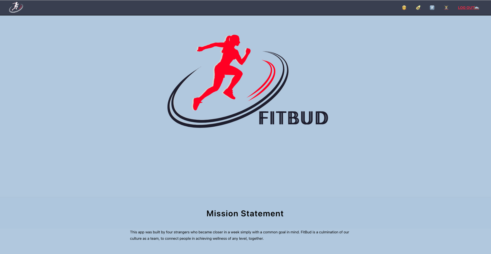

## [Use FitBud Here](https://fit-bud.netlify.app/)
FitBud is the ultimate fitness companion that provides a comprehensive solution to all your fitness needs. 

Have you ever felt unmotivated to workout and eat healthier? 
FitBud features a vibrant community where you can connect with like-minded individuals, share your progress, and receive support and encouragement along the way. With FitBud, you'll never have to worry about what to eat again. Our meal prep feature provides you with a variety of healthy and delicious options that can be tailored to your specific dietary requirements. 

Whether you're a beginner or an experienced fitness enthusiast, FitBud's workout schedule feature will help you create and stick to a personalized workout plan that fits your schedule and goals. Join FitBud today and take control of your health and fitness journey!

Planning materials and wireframes can be found [here](https://trello.com/b/Lv6op2WF/fit-bud)
## Technologies Used
* React
* Express
* Node.js
* Mongoose
* MongoDB
* JavaScript
* HTML
* CSS
* Git

## Credits
* 

## Ice Box
- [ ] User-to-User Direct Messaging feature
- [ ] 
- [ ] 
- [ ] 
- [ ] 